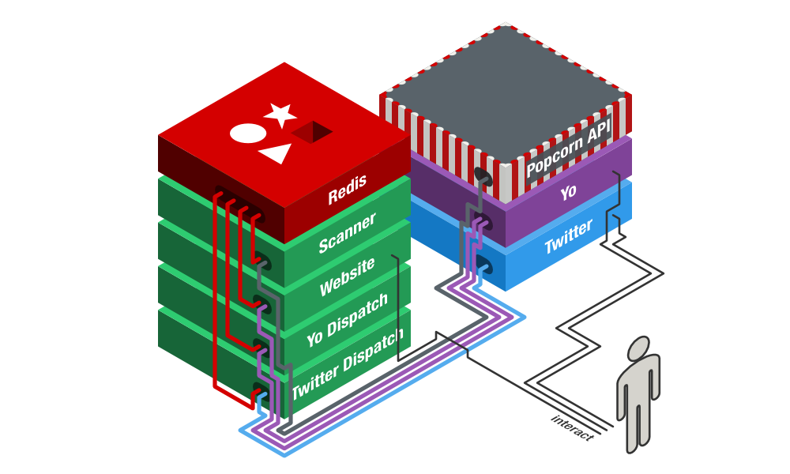

YOMYPOPCORN Scanner
===================



This is the **scanner** app of the YOMYPOPCORN stack. It does the following tings:

 - **Full scan**: Periodically scans the Popcorn API for new shows.
 - **Active scan**: Periodically checks all *active* shows (shows that will have new episodes) for new episodes.
 - **Prepare Yo messages**: Prepares a new Yo message for every subscriber of a show when a new episode is available.
 - **Prepare tweets**: Prepares a new tweet when a new episode of a show is available.

## Installation

```sh
npm install -g yomypopcorn-scanner
```

## Command-line Usage

### Examples

Deamon mode. Periodically perform both types of scans. See `*-scan-cron-pattern` options.

```sh
yomypopcorn-scanner
```

Scan the Popcorn API for new shows.

```sh
yomypopcorn-scanner --full-scan
```

Check *active* shows for new episodes.

```sh
yomypopcorn-scanner --active-scan
```

### Options

 - `-d | --debug`: Print debug output to the console.
 - `--redis-socket <path>`: Connect to Redis through a Unix socket instead of over the network.
 - `--redis-host <host>`  *(default: 127.0.0.1)*: Hostname or IP of the Redis server.
 - `--redis-port <port>` *(default: 6379)*: Port of the Redis server.
 - `--redis-password <password>`: Password of the Redis server.
 - `--eztv-rate-limit <requests/per-ms>` *(default: 1/1000)*: Rate limit for the Popcorn API in number of requests per number of milliseconds. E.g. "1/1000" is once every second, "10/60000" is ten times every minute.
 - `--fanarttv-apikey <key>` *(required)*: fanart.tv API key
 - `--full-scan-cron-pattern` *(default: `0 0 0 * * *`)*: A cron pattern for the full scan in daemon mode.
 - `--active-scan-cron-pattern` *(default: `0 0 1-23 * * *`)*: A cron pattern for the active scan in daemon mode.


## License

MIT
